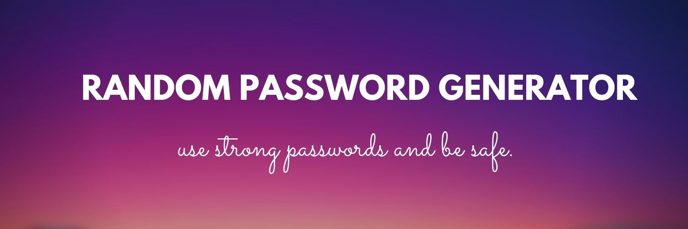

<h1 align="center">Random Password Generator🛠</h1>

 
 

  

  

<!-- TABLE OF CONTENTS -->

  
Table of Contents

  <ol>
    <li>
      <a href="">Problem Statement</a>
    </li>
    <li><a href="">Features of our project</a></li>
    <li><a href="">Tech Stacks</a></li>
    <li><a href="">Work Flow</a></li>
    <li><a href="">First look of our website</a></li>
    <li><a href="">Team Members</a></li>
    <li><a href="">Connect with team members</a></li>
    <li><a href="">Acknowledgments</a></li>
  </ol>

  
# PROBLEM STATEMENT 💡

#### 

## FEATURES OF OUR PROJECT (different sections):👇

- 

## TECH STACKS 🛒
1. HTML
2. CSS
3. JavaScript
4. React
5. Nodejs

## WORKFLOW 📃

- [x] Week 1 : Submission of phase -1 report and focused upon searching problem statement
- [x] Week 2 : 
- [x] Week 3 :
- [ ] Week 4 :
- [ ] Week 5 :

 

## UI/UX OF OUR WEBSITE:🎨

 

## TEAM MEMBERS ✍
1. Ankan Das
2. Rashi Shukla
3. Amandeep Singh

## Connect with team members

<!-- LinkedIn IDs -->

